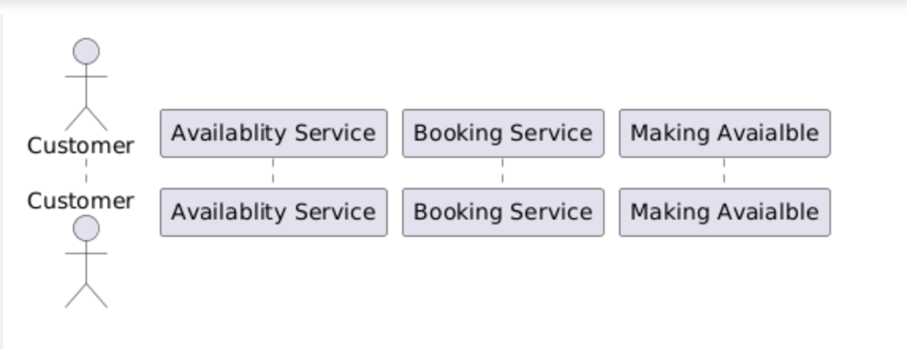

# Detailed Design Document for Parking Lot Problem.
- What :- Parking lot system
- Why :- To manage/solve parking problem efficiently.
- How :- Build a System which can manage parking lot of various types of vehicle.

# Problem Statement
- Design a Parking Lot System where customers can park their vehicles based on availability.

# Functional Requirement
- Users can check availability and park their vehicles accordingly.
- Users can park any type of vehicle based on their requirements.
- Users should have a UI or terminal to check available parking slots.
- Users can initial a 
# Non-Functional Requirement

- Scalability
- Security
- Usability
- Performance

# Solution Overview

Provide a high-level description of the proposed solution. This section should summarize how the problem will be addressed.
<!-- https://editor.plantuml.com/uml/NSvB3e0W30JGFQTeF8decXKdA4XCOmK2nSJR-rlXB2SlanchO96siq8lgS3SggGz59NlcZnbZ0A3Ff0O7PESO4Cvo8S1i8AslPjIsYYkdPb-nk1BdabannyoMjqPGroUAnS0 -->

## Design Consideration

Discuss key factors influencing the design of the solution, such as constraints, trade-offs, and potential risks.

## Mental Model Solution

Explain the approach using a mental model that helps conceptualize the solution effectively.

## Approaches

Detail various approaches that can be taken to solve the problem, comparing their advantages and disadvantages.

# Appendix

Include any additional information, references, or supplementary material that may be useful for understanding the document.

# Resources
Resources

